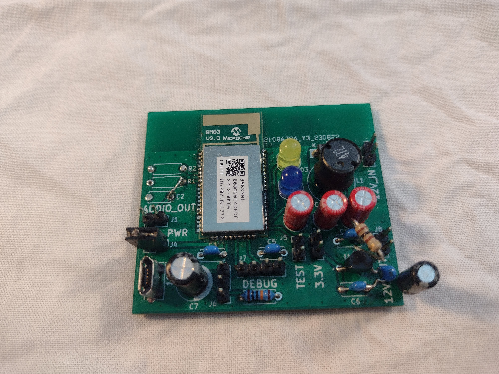

# BlueBox
The Bluebox Project aims to develop a board that incorporates a Bluetooth audio receiver and a power amplifier, designed to upgrade passive speakers into active Bluetooth speakers. The selection of Through-Hole Technology (THT) parts ensures that this project can be easily assembled in workshops without the need for sophisticated tools. The project utilizes the BM83 module from Microchip as the Bluetooth receiver.

## Prototype I (2023)

The first prototype utilized an external audio board with a Texas Instruments TPA3116D amplifier. Unfortunately, a significant amount of digital switching noise from the BM83 module is amplified by the amplifier.

## Prototype II (WIP)
The second prototype will utilize a Texas Instruments TAS5828M amplifier. The amplifier chip will be integrated into the custom PCB. The advantage of the TAS5828M lies in its digital input, which is expected to prevent the amplification of switching noise.